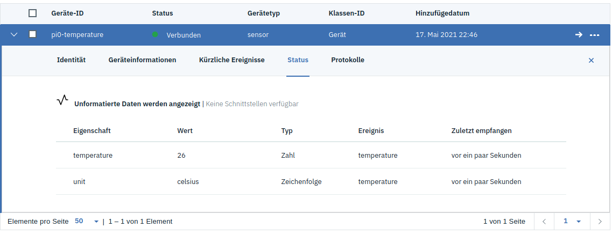

# Watson MQTT example

This application connects to the IBM Watson IOT platform using paho-mqtt
and publishes sensor data in a topic.

## Prerequisites

- [Python 3](https://www.python.org)
- [paho-mqtt](https://github.com/eclipse/paho.mqtt.python)

## Installation

Install dependencies with pip

```shell
pip install -r requirements.txt
```

## Usage

1. Copy the example configuration `config-sample.py` to `config.py`
1. Create a new device in imcloud.com and enter the credentials
1. IMPORTANT: Open the devices **status** section in the dashboard before running.
   The messages will not be visible otherwise.
1. Run the application

```shell
python watson_client.py
```

This should result into messages being published on the broker:



## TODO

- Add a real temperature sensor
- Check if errors can be raised if connection fails or messages are not published

## References

- [Watson IOT Platform Documentation - Communicating with devices (MQTT)](https://www.ibm.com/docs/en/watson-iot-platform?topic=devices-communicating-mqtt)
- [Paho MQTT to Watson IOT (Stackoverflow)](https://stackoverflow.com/questions/46664862/python-paho-mqtt-og-ibm-watson-iot)
